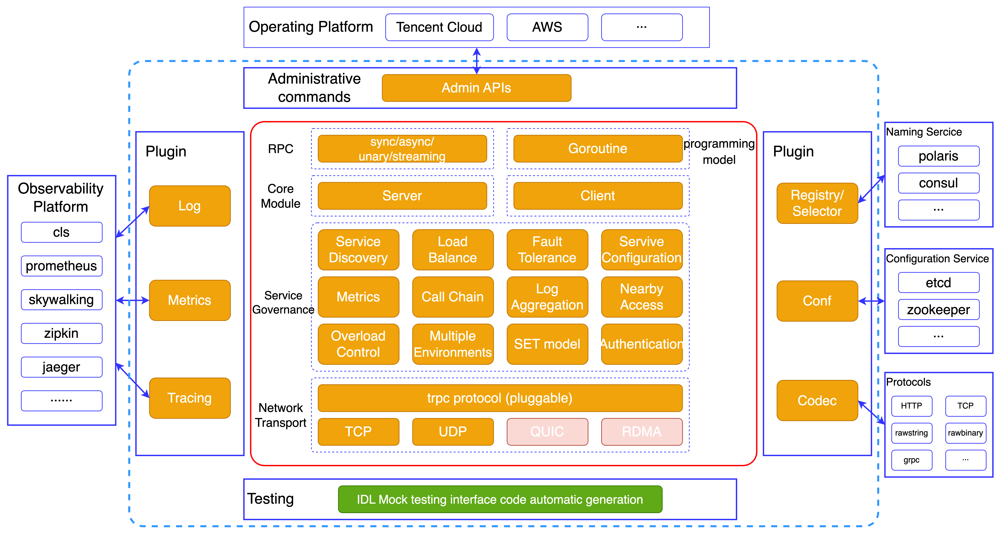

English | [中文](README.zh_CN.md)

# tRPC-Java Framework

[](https://github.com/trpc-group/trpc-java/blob/master/LICENSE)
[](https://github.com/trpc-group/trpc-java/releases)
[](https://github.com/trpc-group/trpc-java/tree/master/docs/)
[](https://codecov.io/gh/trpc-group/trpc-java)

tRPC-Java, as the Java language implementation of [tRPC](https://github.com/trpc-group/trpc), is a
battle-tested microservices framework that has been extensively validated in production
environments. It not only delivers high performance but also offers ease of use and testability.

For more information, please refer to the [related documentation](#related-documentation).

## Overall Architecture



tRPC-Java has the following features:

- Works across languages
- Support multi-protocols
- Streaming RPC
- Rich plugin ecosystem
- Scalability
- Load balance
- Flow & Overload control
- Support coroutine

## Tutorial

### Dependency environment

JDK 8+, Maven 3.6.3+

### Import dependencies

```pom
<dependencies>
    <dependency>
        <groupId>com.tencent.trpc</groupId>
        <artifactId>trpc-mini</artifactId>
        <version>1.0.0</version>
    </dependency>
</dependencies>
```

#### Use coroutine

It is recommended to use [Tencent Kona JDK FIBER 8](https://github.com/Tencent/TencentKona-8). For
usage examples,
see [coroutine](https://github.com/trpc-group/trpc-java-examples/tree/master/trpc-coroutine)

<h2 id="2">Related Documentation</h2>

- [Quick start](/docs/en/1.quick_start.md)
- [Basic tutorial](/docs/en/2.basic_tutorial.md)
- [Stub code generation tool](/docs/en/3.protobuf_stub_plugin.md)
- [Configuration parameters](/docs/en/4.configuration.md)
- [More examples](https://github.com/trpc-group/trpc-java-examples)

## How to Contribute

If you're interested in contributing, please take a look at
the [contribution guidelines](CONTRIBUTING.md) and check
the [unassigned issues](https://github.com/trpc-group/trpc-java/issues) in the repository. Claim a
task and let's contribute together to tRPC-Java.

## LICENSE

tRPC-Java is licensed under the [Apache License Version 2.0](LICENSE).