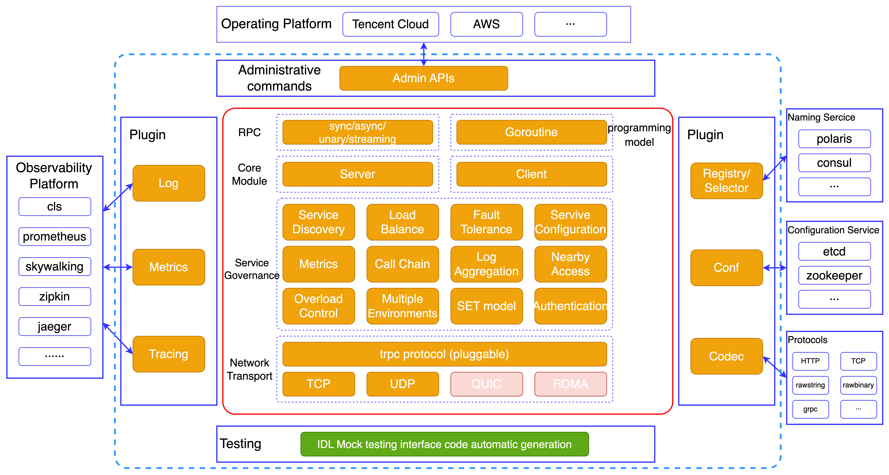

<!--@nrg.languages=en,zh_CN-->
<!--@nrg.defaultLanguage=en-->
English | [中文](README.zh_CN.md)<!--en-->
<!--en-->
# tRPC-Java Framework<!--en-->
<!--en-->
[](https://github.com/trpc-group/trpc-java/blob/master/LICENSE)<!--en-->
[](https://github.com/trpc-group/trpc-java/releases)<!--en-->
[](https://github.com/trpc-group/trpc-java/tree/master/docs/)<!--en-->
[](https://codecov.io/gh/trpc-group/trpc-java)<!--en-->
<!--en-->
tRPC-Java, as the Java language implementation of [tRPC](https://github.com/trpc-group/trpc), is a<!--en-->
battle-tested microservices framework that has been extensively validated in production<!--en-->
environments. It not only delivers high performance but also offers ease of use and testability.<!--en-->
<!--en-->
For more information, please refer to the [related documentation](#related-documentation).<!--en-->
<!--en-->
## Overall Architecture<!--en-->
<!--en-->
<!--en-->
<!--en-->
tRPC-Java has the following features:<!--en-->
<!--en-->
- Works across languages<!--en-->
- Support multi-protocols<!--en-->
- Streaming RPC<!--en-->
- Rich plugin ecosystem<!--en-->
- Scalability<!--en-->
- Load balance<!--en-->
- Flow & Overload control<!--en-->
- Support coroutine<!--en-->
<!--en-->
## Tutorial<!--en-->
<!--en-->
### Dependency environment<!--en-->
<!--en-->
JDK 1.8.0_251+, Maven 3.6.3+<!--en-->
<!--en-->
> Please compile tRPC-Java through `mvn -Dmaven.test.skip=true clean install`. If you want to run unit tests, you need to use JDK 8.<!--en-->
<!--en-->
### Import dependencies<!--en-->
<!--en-->
```pom<!--en-->
<dependencies><!--en-->
    <dependency><!--en-->
        <groupId>com.tencent.trpc</groupId><!--en-->
        <artifactId>trpc-mini</artifactId><!--en-->
        <version>1.0.0</version><!--en-->
    </dependency><!--en-->
</dependencies><!--en-->
```<!--en-->
<!--en-->
#### Use coroutine<!--en-->
<!--en-->
It is recommended to use [Tencent Kona JDK FIBER 8](https://github.com/Tencent/TencentKona-8). For<!--en-->
usage examples,<!--en-->
see [coroutine](https://github.com/trpc-group/trpc-java-examples/tree/master/trpc-coroutine)<!--en-->
<!--en-->
<h2 id="2">Related Documentation</h2><!--en-->
<!--en-->
- [Quick start](/docs/en/1.quick_start.md)<!--en-->
- [Basic tutorial](/docs/en/2.basic_tutorial.md)<!--en-->
- [Stub code generation tool](/docs/en/3.protobuf_stub_plugin.md)<!--en-->
- [Configuration parameters](/docs/en/4.configuration.md)<!--en-->
- [More examples](https://github.com/trpc-group/trpc-java-examples)<!--en-->
<!--en-->
## How to Contribute<!--en-->
<!--en-->
If you're interested in contributing, please take a look at<!--en-->
the [contribution guidelines](CONTRIBUTING.md) and check<!--en-->
the [unassigned issues](https://github.com/trpc-group/trpc-java/issues) in the repository. Claim a<!--en-->
task and let's contribute together to tRPC-Java.<!--en-->
<!--en-->
## LICENSE<!--en-->
<!--en-->
tRPC-Java is licensed under the [Apache License Version 2.0](LICENSE).<!--en-->
[English](README.md) | 中文<!--zh_CN-->
<!--zh_CN-->
# tRPC-Java Framework<!--zh_CN-->
<!--zh_CN-->
[](https://github.com/trpc-group/trpc-java/blob/master/LICENSE)<!--zh_CN-->
[](https://github.com/trpc-group/trpc-java/releases)<!--zh_CN-->
[](https://github.com/trpc-group/trpc-java/tree/master/docs/)<!--zh_CN-->
[](https://codecov.io/gh/trpc-group/trpc-java)<!--zh_CN-->
<!--zh_CN-->
tRPC-Java，作为 [tRPC](https://github.com/trpc-group/trpc) 的 Java<!--zh_CN-->
语言版本，是经过大规模线上业务使用验证过的微服务框架，它不仅性能高，而且易于使用和测试。<!--zh_CN-->
<!--zh_CN-->
更多信息见：[相关文档](#相关文档)<!--zh_CN-->
<!--zh_CN-->
## 整体架构<!--zh_CN-->
<!--zh_CN-->
<!--zh_CN-->
<!--zh_CN-->
tRPC-Java 具有以下特点：<!--zh_CN-->
<!--zh_CN-->
- 跨语言<!--zh_CN-->
- 多通信协议<!--zh_CN-->
- 流式rpc<!--zh_CN-->
- 丰富插件生态<!--zh_CN-->
- 可扩展性<!--zh_CN-->
- 负载均衡<!--zh_CN-->
- 流控和过载保护<!--zh_CN-->
- 支持协程<!--zh_CN-->
<!--zh_CN-->
## 教程<!--zh_CN-->
<!--zh_CN-->
### 依赖环境<!--zh_CN-->
<!--zh_CN-->
JDK 1.8.0_251+, Maven 3.6.3+<!--zh_CN-->
<!--zh_CN-->
> 请通过 `mvn -Dmaven.test.skip=true clean install` 编译tRPC-Java。如果运行单元测试需使用JDK 8执行。<!--zh_CN-->
<!--zh_CN-->
### 引入依赖<!--zh_CN-->
<!--zh_CN-->
```pom<!--zh_CN-->
<dependencies><!--zh_CN-->
    <dependency><!--zh_CN-->
        <groupId>com.tencent.trpc</groupId><!--zh_CN-->
        <artifactId>trpc-mini</artifactId><!--zh_CN-->
        <version>1.0.0</version><!--zh_CN-->
    </dependency><!--zh_CN-->
</dependencies><!--zh_CN-->
```<!--zh_CN-->
<!--zh_CN-->
#### 使用协程<!--zh_CN-->
<!--zh_CN-->
推荐使用 [Tencent Kona JDK FIBER 8](https://github.com/Tencent/TencentKona-8)<!--zh_CN-->
使用示例见[coroutine](https://github.com/trpc-group/trpc-java-examples/tree/master/trpc-coroutine)<!--zh_CN-->
<!--zh_CN-->
<h2 id="2">相关文档</h2><!--zh_CN-->
<!--zh_CN-->
- [快速上手](/docs/zh/1.quick_start.md)<!--zh_CN-->
- [基础教程](/docs/zh/2.basic_tutorial.md)<!--zh_CN-->
- [tRPC-Java桩代码生成工具](/docs/zh/3.protobuf_stub_plugin.md)<!--zh_CN-->
- [配置参数文档](/docs/zh/4.configuration.md)<!--zh_CN-->
- [各种特性的示例代码](https://github.com/trpc-group/trpc-java-examples)<!--zh_CN-->
<!--zh_CN-->
## 如何贡献<!--zh_CN-->
<!--zh_CN-->
如果您有兴趣进行贡献，请查阅[贡献指南](CONTRIBUTING.zh_CN.md)<!--zh_CN-->
并检查 [issues](https://github.com/trpc-group/trpc-java/issues)<!--zh_CN-->
中未分配的问题。认领一个任务，让我们一起为 tRPC-Java 做出贡献。<!--zh_CN-->
<!--zh_CN-->
## LICENSE<!--zh_CN-->
<!--zh_CN-->
tRPC-Java 使用了 [Apache 2.0](LICENSE) 许可证.<!--zh_CN-->
