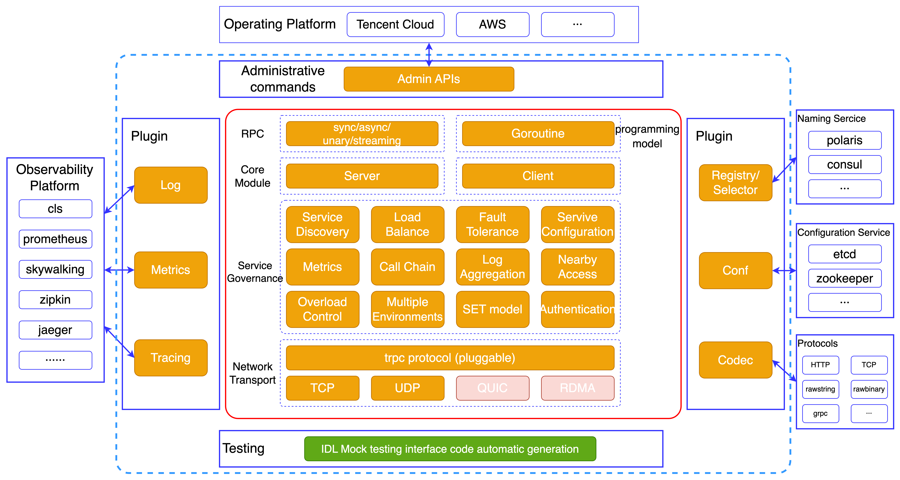

[English](README.md) | 中文

# tRPC-Java Framework

[](https://github.com/trpc-group/trpc-java/blob/main/LICENSE)
[](https://github.com/trpc-group/trpc-java/releases)
[](https://github.com/trpc-group/trpc-java/tree/main/docs/)
[](https://app.codecov.io/gh/trpc.group/trpc-java/tree/main)

tRPC-Java，作为 [tRPC](https://github.com/trpc-group/trpc) 的 Java
语言版本，是经过大规模线上业务使用验证过的微服务框架，它不仅性能高，而且易于使用和测试。

更多信息见：[相关文档](#2)

## 整体架构



tRPC-Java 具有以下特点：

- 跨语言
- 多通信协议
- 流式rpc
- 丰富插件生态
- 可扩展性
- 负载均衡
- 流控和过载保护
- 支持协程

## 教程

### 依赖环境

JDK 8+, Maven 3.6.3+

### 引入依赖(非协程版本)

```pom
<dependencies>
    <dependency>
        <groupId>com.tencent.trpc</groupId>
        <artifactId>trpc-mini</artifactId>
        <version>0.15.0</version>
    </dependency>
</dependencies>
```

### 引入依赖(协程版本)

推荐使用 [Tencent Kona JDK 8](https://github.com/Tencent/TencentKona-8)

```pom
<dependencies>
    <dependency>
        <groupId>com.tencent.trpc</groupId>
        <artifactId>trpc-mini</artifactId>
        <version>0.15.0-FIBER</version>
    </dependency>
</dependencies>
```

<h2 id="2">相关文档</h2>

- [快速上手](/docs/zh/1.quick_start.md)
- [基础教程](/docs/zh/2.basic_tutorial.md)
- [tRPC-Java桩代码生成工具](/docs/zh/3.protobuf_stub_plugin.md)
- [配置参数文档](/docs/zh/4.configuration.md)
- [各种特性的示例代码](https://github.com/trpc-group/trpc-java-examples)

## 如何贡献

如果您有兴趣进行贡献，请查阅[贡献指南](CONTRIBUTING.md)并检查 [issues](https://github.com/trpc-group/trpc-java/issues)
中未分配的问题。认领一个任务，让我们一起为 tRPC-Java 做出贡献。

## LICENSE

tRPC-Java 使用了 [Apache 2.0](LICENSE) 许可证.